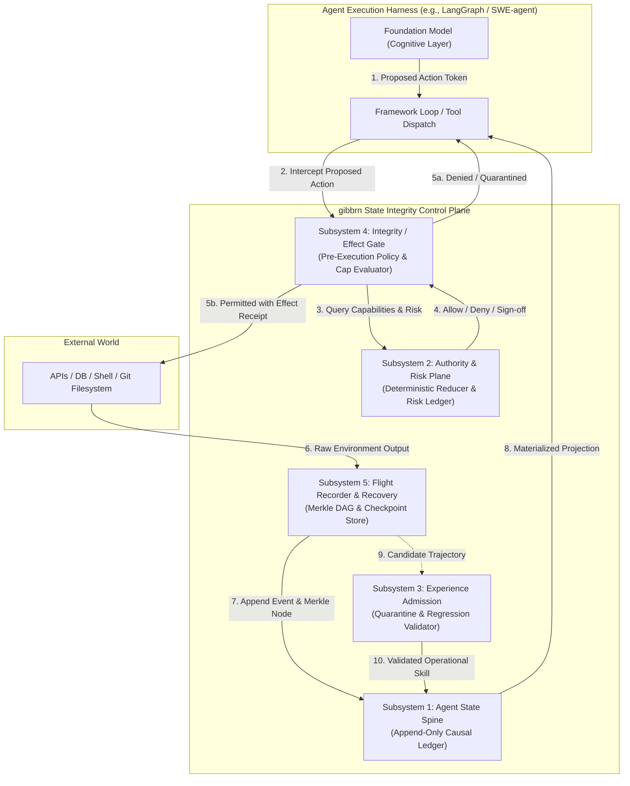

# 04 — System Architecture and Subsystem Specifications

**Project Name:** GIBBRN  
**Document Track:** Systems Engineering & Architectural Design  
**Date:** September 2026  
**Audience:** Systems Architects, Distributed Infrastructure Engineers, 1517 Fund  
**Design Philosophy:** Pragmatic Substrate Reuse; Innovation in Agent-State Semantics  

---

## 1. Architectural Philosophy: Do Not Reinvent Storage

A core trap of deep-tech AI infrastructure projects is attempting to build custom distributed databases, bespoke consensus algorithms, or greenfield workflow schedulers. **gibbrn explicitly rejects this path.**

The technical novelty of gibbrn lies in **agent-state integrity semantics, authority formalization, and causal recovery**, not in novel disk layout algorithms. Wherever battle-tested infrastructure exists, gibbrn integrates as an abstraction layer:

```
+-----------------------------------------------------------------------------------+
|                            GIBBRN BOUNDARY SEPARATION                             |
+-----------------------------------------------------------------------------------+
|  DELIBERATELY DELEGATED TO INDUSTRY STANDARDS:                                    |
|  - Relational Persistence & Append-Only Log: PostgreSQL / SQLite (WAL mode)       |
|  - Distributed Timer & Long-Running Schedulers: Temporal / DBOS                   |
|  - High-Volume Telemetry & Log Analytics: DuckDB / OpenTelemetry / Parquet       |
|  - Versioned Artifact Storage: Git / Content Addressable Storage (SHA-256 CAS)    |
|  - Process Sandboxing & Isolation: Docker / gVisor / Linux cgroups                |
+-----------------------------------------------------------------------------------+
|  PROPRIETARY GIBBRN RESEARCH & INNOVATION:                                        |
|  - Four-Tier State Semantics & Access Reducers                                    |
|  - Epistemic Flight Recorder with Causal Lineage Attribution                      |
|  - Deterministic Capability & Effect Gate (Pre-execution interceptor)             |
|  - Automated Experience Admission & Regression Verification Pipeline              |
|  - Framework-Neutral State Projections (LangGraph, AutoGen, Native Loops)         |
+-----------------------------------------------------------------------------------+
```

---

## 2. High-Level Subsystem Topology

gibbrn is structured into five cohesive subsystems operating as a sidecar or embedded control plane around autonomous agent workflows.



---

## 3. Subsystem Detailed Specifications

### 3.1 Subsystem 1: Agent State Spine (The Canonical Ledger)
*   **Responsibility:** Maintains the single source of truth for agent identities, causal step dependencies, parent-child agent delegations, and state version lineage.
*   **Storage Substrate:** Backed by PostgreSQL (production) or SQLite WAL (local edge), structured as an append-only event store.
*   **Event Schema:**
    ```json
    {
      "event_id": "evt_98f12a8c",
      "parent_event_id": "evt_12e34b5a",
      "trajectory_id": "traj_0192a812",
      "agent_id": "agent_worker_7a",
      "step_depth": 14,
      "event_type": "EFFECT_PROPOSED",
      "timestamp_utc": "2026-09-03T18:45:00.102Z",
      "payload_hash": "sha256:7f83b1657ff1fc53b92dc18148a1d65dfc2d4b1fa3d677284addd200126d9069",
      "payload": {
        "action_name": "execute_bash_command",
        "parameters": {"cmd": "git push origin main"}
      }
    }
    ```
*   **CQRS Projections:** The Spine exposes customized, read-only materialized views (State Projections) for distinct consumers:
    1.  *Cognitive Projection:* Formats bounded memory snippets, active task goals, and valid operational skills into prompt tokens.
    2.  *Supervisory Projection:* Real-time dashboard showing dependency depth, budget burn rate, and unresolved anomalies.
    3.  *Recovery Projection:* Minimal serialized snapshot required to restore an agent to a specific checkpoint $C_k$.

### 3.2 Subsystem 2: Authority & Persistent Risk Control Plane
*   **Responsibility:** Enforces the principle that *the foundation model is not a root of trust*. Converts raw authorization events into an active capability set via a pure mathematical reducer.
*   **Authority Reducer:**
    $$\mathcal{S}_{\text{auth}}(t) = \mathcal{R}\left(\mathcal{S}_{\text{auth}}(t-1), e_t\right)$$
    Where $e_t$ can only be: `CAPABILITY_GRANTED`, `CAPABILITY_REVOKED`, `BUDGET_ADJUSTED`, or `POLICY_UPDATED`.
*   **Persistent Risk Ledger:** Unlike traditional session-scoped guardrails that reset on every invocation, the Risk Ledger tracks lifetime-scoped indicators across repeated agent loops:
    - *Consecutive Anomaly Counter:* Escalates supervision if the agent encounters repeated tool execution failures.
    - *Cumulative Exposure Dollar Pool:* Halts execution when total financial side-effects exceed threshold $\Theta_{\text{run}}$, requiring human cryptographic re-authorization.
    - *Provenance Violation Flag:* Instantly trips a circuit breaker if an incoming instruction fails provenance origin checks.

### 3.3 Subsystem 3: Experience & Skill Admission Engine
*   **Responsibility:** Governs the transition of transient trajectory successes into permanent operational knowledge ($\mathcal{S}_{\text{ops}}$).
*   **The Admission Pipeline:**
    1.  *Trajectory Extraction:* When an agent successfully resolves an issue with depth $d > 5$, a background extractor synthesizes a generalized skill artifact (Python script or declarative JSON tool macro).
    2.  *Quarantine Ingestion:* The skill is committed to a staging branch in Git with status `QUARANTINE`.
    3.  *Automated Regression Suite:* The skill is executed against a battery of 20+ canonical benchmark tasks in isolated micro-sandboxes (Docker/gVisor).
    4.  *Admissibility Evaluation:* If the skill introduces zero security violations, causes no regressions on older tasks, and demonstrates a latency/token improvement, it is cryptographically signed and tagged `ACTIVE`.
    5.  *Causal Revocation:* If an active skill later correlates with runtime failures, the Admission Engine rolls back the Git commit and issues a revocation event to the Spine.

### 3.4 Subsystem 4: Integrity / Effect Gate
*   **Responsibility:** The physical checkpoint between the agent's cognitive generation and the external world.
*   **Intercept Pattern:** Implemented as a lightweight forward proxy or library wrapper intercepting `ToolCall` objects.
*   **Verification Steps (Executed synchronously in $<15\text{ms}$):**
    ```
    [Incoming Proposed Action]
               |
    1. Schema & Type Check (Pydantic / JSONSchema)
               |
    2. Identity & Capability Check (Matches active token scope?)
               |
    3. State Precondition Check (Does target file/resource exist?)
               |
    4. Risk Ledger & Budget Verification (Cumulative cost <= Limit?)
               |
    5. Irreversibility Classification (Is action non-idempotent?)
               |
    [Decision: ALLOW (Inject Effect Receipt) | DENY | ESCALATE_TO_HUMAN]
    ```

### 3.5 Subsystem 5: Flight Recorder & Recovery
*   **Responsibility:** Provides full causal reconstruction of execution trajectories and bounded, reproducible recovery.
*   **Causal Reconstruction vs. Deterministic Replay:** LLM token generations are inherently non-deterministic. Attempting bit-for-bit replay of model thoughts is fundamentally flawed. Instead, gibbrn implements **Bounded Causal Replay**:
    - During normal operation, the Flight Recorder captures: all state reads, tool inputs, raw tool returns, and external effect receipts.
    - During recovery to step $k$, gibbrn restores canonical state at checkpoint $C_k$, replays all recorded tool outputs deterministically up to $k$, and only invokes the live foundation model for novel steps beyond $k$.
*   **Checkpointing Strategy:** Periodic snapshots of memory, state spine offset, and filesystem deltas stored as content-addressable Git blobs.

---

## 4. Framework-Neutral Integration Topologies

gibbrn is engineered to run seamlessly across heterogeneous agent environments without requiring developers to abandon their preferred frameworks.

```
TOPOLOGY A: In-Process Python SDK (Embedded)
+-------------------------------------------------------------+
| Python Process (LangGraph / AutoGen / CrewAI / Custom)      |
|  [Framework Agent]                                          |
|         |                                                   |
|  [gibbrn Python Client] ---> (Local SQLite WAL / DuckDB)    |
|         |                                                   |
|  [Sandboxed Tools]                                          |
+-------------------------------------------------------------+

TOPOLOGY B: External Sidecar / Forward Proxy (Microservices)
+----------------------------+      +-------------------------+
| Container 1: Agent App     |      | Container 2: gibbrn     |
| (TypeScript / Go / Python) |      | (Rust / Go Daemon)      |
|                            | HTTP |  - Effect Gate          |
| [Agent Harness] ----------+----->|  - PostgreSQL Spine     |
|                            | gRPC |  - Temporal Scheduler   |
+----------------------------+      +-------------------------+
                                                 |
                                                 v
                                        [External Systems]
```

### 4.1 LangGraph Integration Hook
In LangGraph, gibbrn integrates as a custom `Checkpointer` and `ToolNode` middleware:
```python
# Conceptual gibbrn Middleware for LangGraph
from gibbrn import GibbrnSpine, GibbrnEffectGate

spine = GibbrnSpine(connection_string="postgresql://...")
effect_gate = GibbrnEffectGate(spine=spine)

# Intercept tool node execution
def monitored_tool_node(state):
    proposed_action = state["messages"][-1].tool_calls[0]
    verification = effect_gate.verify(
        agent_id=state["agent_id"],
        action=proposed_action
    )
    if not verification.allowed:
        return {"error": f"Effect Gate Blocked: {verification.reason}"}
    
    # Execute tool and record receipt
    result = execute_tool(proposed_action)
    effect_receipt = spine.record_effect(proposed_action, result)
    return {"messages": [result], "effect_receipt": effect_receipt}
```

---

## 5. Architectural Invariants and Failure Containment

Table 4.1 details how gibbrn's architectural boundaries isolate system failures.

### Table 4.1: Failure Mode Containment

| Failure Event | Containment Boundary | System Behavior |
| :--- | :--- | :--- |
| **Model Hallucination / Delusion** | Cognitive Layer ($\mathcal{S}_{\text{cog}}$) | Contained to scratchpad; Effect Gate blocks invalid tool calls. |
| **Prompt Injection Payload** | Tool Observation Buffer | Stripped of authority; cannot alter $\mathcal{S}_{\text{auth}}$ reducer. |
| **Tool Execution Crash (500 Error)** | Runtime State ($\mathcal{S}_{\text{safe}}$) | Logged to Flight Recorder; triggers automated backoff/retry. |
| **Flawed Skill Promotion Attempt** | Admission Engine Quarantine | Test suite fails in micro-sandbox; skill discarded before reaching $\mathcal{S}_{\text{ops}}$. |
| **Catastrophic Infinite Loop** | State Spine Dependency Depth Tracker | Hard stop triggered when dependency depth exceeds Maximum Dependable Depth. |
