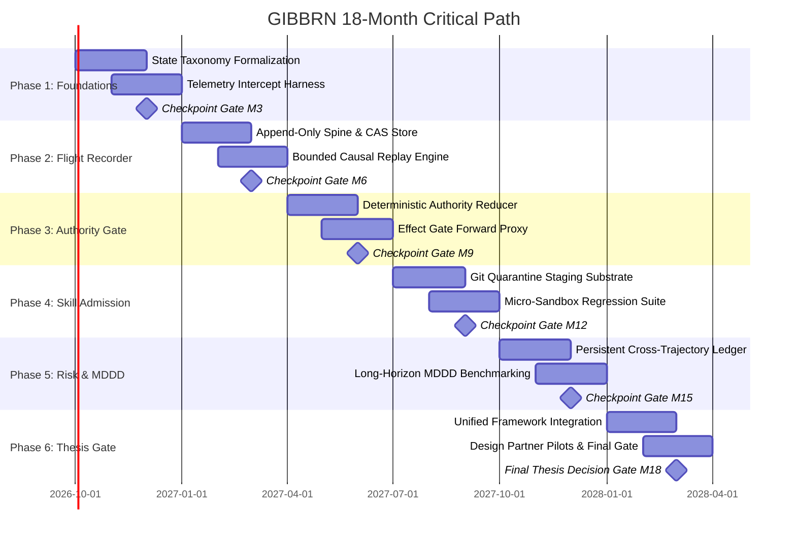

# 07 — 18-Month Checkpoint-Gated R&D Roadmap

**Project Name:** GIBBRN  
**Document Track:** Project Engineering & Research Gate Governance  
**Date:** September 2026  
**Audience:** Technical Founders, Deep-Tech Investors, 1517 Fund  
**Governance Framework:** Empirical Checkpoint Gates (Proceed / Narrow / Pivot / Kill)  

---

## 1. Roadmap Philosophy: Empirical Gates Over Arbitrary Timelines

Traditional venture-backed software startups build commercial roadmaps around product feature launches, customer discovery sprints, and marketing milestones. **An R&D systems program cannot operate this way.**

gibbrn structures its 18-month timeline into six sequential three-month research phases, each terminating in a **binding Checkpoint Gate**. Every gate specifies exact quantitative criteria that trigger one of four governance decisions:
1.  **PROCEED:** Hypotheses validated; advance to next phase.
2.  **PROCEED WITH NARROWER THESIS:** Selected mechanisms showed zero value; prune components and concentrate resources.
3.  **PIVOT:** Core assumptions violated, but adjacent systems value identified (e.g., pivot from full state plane to specialized effect proxy).
4.  **KILL / STOP:** Null hypothesis cannot be rejected; return unspent capital and publish negative results.

```
+-----------------------------------------------------------------------------------+
|                           18-MONTH R&D TIMELINE & GATES                           |
+-----------------------------------------------------------------------------------+
|  M01 - M03: Phase 1 — Foundations & Measurement Harness       [GATE M3]           |
|  M04 - M06: Phase 2 — Flight Recorder & Causal Reconstruction  [GATE M6]           |
|  M07 - M09: Phase 3 — Authority Integrity & Effect Gate       [GATE M9]           |
|  M10 - M12: Phase 4 — Experience Admission & Skill Quarantine  [GATE M12]          |
|  M13 - M15: Phase 5 — Persistent Risk & Dependency Depth (MDDD)[GATE M15]          |
|  M16 - M18: Phase 6 — Integration, Cross-Runtime & Thesis Gate [GATE M18]          |
+-----------------------------------------------------------------------------------+
```

---

## 2. Phase-by-Phase Research Specifications

### Months 01–03: Foundations & Experimental Measurement Harness
*   **Primary Research Objective:** Formalize state taxonomy v0, construct the baseline benchmark harness, and prove that fine-grained agent event capture is computationally feasible.
*   **Key Engineering Tasks:**
    - Build `gibbrn-schema-v0`: JSONSchema and Pydantic models for the Four-Tier State Taxonomy ($\mathcal{S}_{\text{cog}}, \mathcal{S}_{\text{ops}}, \mathcal{S}_{\text{auth}}, \mathcal{S}_{\text{safe}}$).
    - Implement the synchronous interception proxy for LangGraph and native Python agent loops.
    - Establish standardized testbed container environments (Docker/gVisor) with reproducible network isolation.
    - Reproduce baseline multi-step error compounding results on SWE-bench Lite.
*   **Checkpoint M3 Deliverables:**
    - Functioning open-source telemetry harness capable of instrumenting LangGraph and SWE-agent.
    - Empirical latency profile of event interception across 1,000 tool executions.
*   **Gate M3 Criteria:**
    - *Success Threshold:* Event capture introduces $\le 30\text{ms}$ latency overhead per tool call; zero data loss in WAL storage across 1,000 steps.
    - *Decision if Failed:* **KILL** if event capture overhead exceeds $150\text{ms}$ or fundamentally destabilizes framework execution loops.

---

### Months 04–06: Flight Recorder & Causal Reconstruction
*   **Primary Research Objective:** Implement the append-only State Spine and determine whether Merkle-chained causal event trees outperform standard linear trace logs in diagnosing failures.
*   **Key Engineering Tasks:**
    - Deploy append-only PostgreSQL / SQLite event store with cryptographic SHA-256 parent chaining.
    - Implement the **Bounded Causal Replay** engine (deterministic replay of tool receipts up to step $k$).
    - Construct the automated failure-attribution algorithm to locate the "divergence step" in crashing trajectories.
    - Run the RQ2 benchmark across 150 annotated failure trajectories from AgentErrorBench.
*   **Checkpoint M6 Deliverables:**
    - Working Flight Recorder prototype with CLI tool `gibbrn-replay`.
    - Experimental report comparing gibbrn against OpenTelemetry and LangSmith traces.
*   **Gate M6 Criteria:**
    - *Success Threshold:* Causal Reconstruction Rate ($\text{CRR}$) $\ge 80\%$, achieving at least a $2\times$ accuracy improvement over native tracing.
    - *Decision if Failed:* **MODIFY / NARROW**. If causal replay proves intractable due to non-deterministic external tool behavior, kill live re-execution and restrict the recorder to read-only post-mortem analysis.

---

### Months 07–09: Authority Integrity & Effect Gate
*   **Primary Research Objective:** Validate whether separating cognitive memory from canonical authority eliminates endogenous authority laundering and unauthorized external mutations.
*   **Key Engineering Tasks:**
    - Implement the deterministic **Authority Reducer** operating over signed capability events.
    - Build the **Integrity / Effect Gate** forward proxy intercepting API, database, and filesystem writes.
    - Implement short-lived, ephemeral capability token issuance.
    - Execute the RQ3 red-team benchmark: 100 prompt injection and authority escalation attacks.
*   **Checkpoint M9 Deliverables:**
    - Standalone Effect Gate daemon with sub-15ms intercept latency.
    - Comprehensive red-team evaluation report documenting $\text{UER}$ and false-denial rates.
*   **Gate M9 Criteria:**
    - *Success Threshold:* Unauthorized-Effect Rate $\text{UER} \le 0.001$ (zero out-of-scope executions in benchmark); False-Denial Rate $\text{FDR} \le 2.0\%$.
    - *Decision if Failed:* **PIVOT**. If prompt injections can still manipulate parameters in allowed tools to cause out-of-scope harm, pivot focus from pure capability tokens to deep semantic payload verification.

---

### Months 10–12: Experience & Skill Admission Engine
*   **Primary Research Objective:** Determine whether automated sandbox testing and regression evaluation can prevent memory poisoning and performance degradation in continual learning loops.
*   **Key Engineering Tasks:**
    - Construct the **Admission Pipeline**: Candidate extractor $\to$ Git quarantine branch $\to$ Micro-sandbox executor.
    - Build an automated regression test runner using 25 canonical validation tasks.
    - Implement causal skill revocation (automated rollback of skills correlating with runtime errors).
    - Execute the RQ4 benchmark: 300 sequential tasks under 15% MINJA adversarial poisoning pressure.
*   **Checkpoint M12 Deliverables:**
    - Git-backed versioned operational skill repository with automated CI/CD admission harness.
    - Benchmark paper on continual agent learning under memory poisoning conditions.
*   **Gate M12 Criteria:**
    - *Success Threshold:* False-Promotion Rate $\text{FPR} \le 0.02$; downstream benchmark performance retention $\ge 98\%$ under adversarial attack.
    - *Decision if Failed:* **MODIFY / DEFER**. If automated regression testing is too computationally expensive ($>5\times$ base token cost), defer fully autonomous promotion and introduce a human-in-the-loop sign-off gate.

---

### Months 13–15: Persistent Risk Ledger & Long-Horizon Reliability (MDDD)
*   **Primary Research Objective:** Test whether lifetime-scoped risk tracking and automated checkpoint rollback can measurably extend Maximum Dependable Dependency Depth ($\text{MDDD}$).
*   **Key Engineering Tasks:**
    - Implement the cross-trajectory **Persistent Risk Ledger** tracking cumulative resource burn, rate anomalies, and unresolved errors across multi-day lifespans.
    - Integrate automated checkpoint triggering based on dependency depth and anomaly score heuristics.
    - Execute the RQ6 and RQ5 benchmarks on GAIA Level 3 and deep multi-issue SWE-bench tasks ($d \ge 30$).
*   **Checkpoint M15 Deliverables:**
    - Comprehensive statistical report on $\text{MDDD}$ extension curves.
    - Demonstration of distributed exfiltration detection across multi-session attacks.
*   **Gate M15 Criteria:**
    - *Success Threshold:* gibbrn-controlled agents achieve $\text{MDDD}_{0.90} \ge 2.0\times$ the depth of baseline agents ($p < 0.01$).
    - *Decision if Failed:* **KILL**. If external state management and checkpoint rollback fail to double dependable dependency depth, the central systems thesis of gibbrn is falsified.

---

### Months 16–18: Integration, Cross-Runtime Validation & Thesis Gate
*   **Primary Research Objective:** Integrate all surviving subsystems into a unified, framework-neutral control plane, evaluate cross-runtime portability (RQ8), and reach the final Thesis Verdict.
*   **Key Engineering Tasks:**
    - Package the unified control plane: Embedded Python SDK + Standalone Rust/Go Sidecar.
    - Validate across LangGraph, SWE-agent, and native Python loops across Claude 3.5 Sonnet and Gemini 2.0 Flash.
    - Run final end-to-end benchmark suite across all 8 research questions.
    - Conduct external architecture review with potential design partners and systems researchers.
*   **Checkpoint M18 Deliverables:**
    - Fully documented, reproducible open-source research prototype.
    - Final 18-Month Comprehensive Research Report and Architecture Decision Records (ADRs).
    - Design-partner pilot deployment with at least two external engineering teams.
*   **Final Gate M18 Verdict:**
    - **PROCEED TO SEED ROUND / COMMERCIALIZATION:** If $\text{MDDD} \ge 2.0\times$, $\text{UER} = 0$, cross-runtime integration overhead $<25\text{ms}$, and design partners validate utility.
    - **PIVOT TO SPECIALIZED SECURITY GATE:** If only the Effect Gate and Authority Reducer deliver enterprise value.
    - **STOP / DISSOLVE:** If foundation model updates render external state control obsolete.

---

## 3. Critical Path and Dependency Graph



---

## 4. High-Risk Assumptions and Kill Criteria

Table 7.1 details the existential failure risks monitored throughout the roadmap.

### Table 7.1: Risk Matrix and Binding Kill Conditions

| Research Assumption | Failure Symptom | Evaluation Milestone | Binding Action if Triggered |
| :--- | :--- | :--- | :--- |
| **A1: Low-Latency Interception** | Intercept proxy adds $>100\text{ms}$ per tool call, creating unacceptable latency drag. | **Gate M3** | **KILL** sidecar architecture; attempt pure compile-time static wrapper or abort. |
| **A2: Causal Replayability** | External environment drift prevents $>70\%$ of bounded replays from reproducing state. | **Gate M6** | **KILL** live replay; restrict recorder exclusively to post-mortem audit logging. |
| **A3: Authority Separability** | Tool parameters are so complex that deterministic gates cannot parse intent without LLM-as-a-judge. | **Gate M9** | **PIVOT** from deterministic reducer to hybrid formal verification / constrained DSL. |
| **A4: Cost-Effective Admission** | Running regression suites for candidate skills consumes $>10\times$ the token cost of original tasks. | **Gate M12** | **KILL** automated self-admission; shift to developer-assisted skill curation. |
| **A5: MDDD Extension** | External checkpointing fails to increase $\text{MDDD}_{0.90}$ by at least $2.0\times$ over native loops. | **Gate M15** | **KILL PROJECT ENTIRELY**; return uncommitted capital. |
| **A6: Model Obsolescence** | Next-generation foundation models solve multi-step state consistency natively with zero decay. | **Continuous** | **KILL PROJECT**; publish comparative empirical autopsy. |
